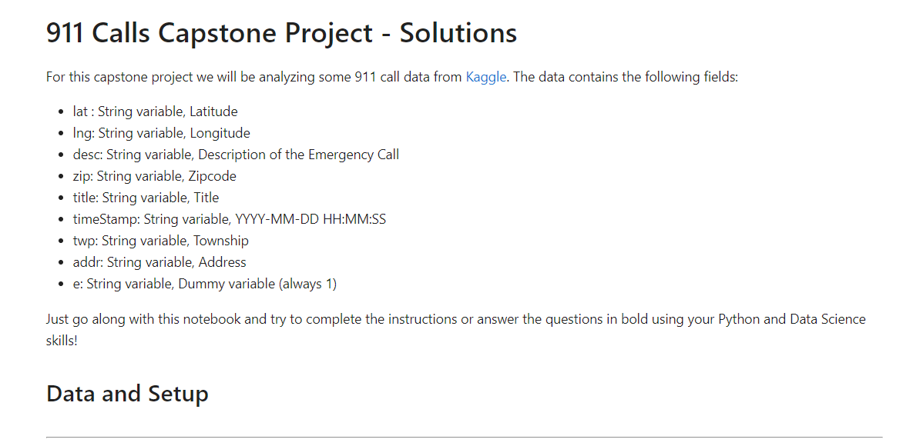

<br/>
<p align="center">
  <h3 align="center">911CallsAnalysis</h3>

  <p align="center">
    A project which analyzes and extracts information from 911 calls
    <br/>
    <br/>
    <a href="https://github.com/itsskofficial/Data-Science">View Demo</a>
    .
    <a href="https://github.com/itsskofficial/Data-Science/issues">Report Bug</a>
    .
    <a href="https://github.com/itsskofficial/Data-Science/issues">Request Feature</a>
  </p>
</p>

 

## Table Of Contents

* [About the Project](#about-the-project)
* [Built With](#built-with)
* [Getting Started](#getting-started)
  * [Prerequisites](#prerequisites)
  * [Installation](#installation)
* [Usage](#usage)
* [Contributing](#contributing)
* [License](#license)
* [Authors](#authors)
* [Acknowledgements](#acknowledgements)

## About The Project



The 911 Calls Analysis Project is a data-driven initiative aimed at extracting valuable insights from emergency call data. Leveraging advanced analytics, this project seeks to examine patterns, response times, and critical information associated with emergency calls. By employing data visualization techniques and statistical analysis, the project aims to enhance emergency response systems, optimize resource allocation, and contribute to the overall improvement of public safety

## Built With

This section should list any major frameworks that you built your project using. Leave any add-ons/plugins for the acknowledgements section. Here are a few examples.

* [Python](https://www.python.org/)
* [Pandas](https://pandas.pydata.org/)
* [Matplotlib](https://matplotlib.org/)
* [Numpy](https://numpy.org/)

## Getting Started

This is an example of how you may give instructions on setting up your project locally.
To get a local copy up and running follow these simple example steps.

### Prerequisites

* **pip:**
  
  Ensure you have Python installed, as pip comes bundled with Python distributions.

  ```sh
  # To upgrade pip to the latest version, run:
  python -m pip install --upgrade pip


### Installation

1. **Clone the repo**

    ```sh
    git clone https://github.com/itsskofficial/Data-Science.git
    ```

2. **Enter into the directory**
    ```sh
    cd Projects/911CallsAnalysis
    ```

3. **Install pip packages**

    ```sh
    pip install -r requirements.txt
    ```

## Usage

The 911 Calls Analysis project is a crucial tool with diverse applications, primarily focused on improving public safety and emergency response strategies. By delving into the patterns and trends within emergency call data, this analysis tool offers valuable insights that can be employed in various contexts. Emergency services can utilize the findings to enhance their operational efficiency, allocate resources more effectively, and streamline response protocols. Government agencies benefit from informed decision-making, contributing to the formulation of impactful policies related to emergency services. Urban planners can leverage the tool to identify areas with higher incidents, aiding in strategic development and resource allocation for safer communities. Additionally, the analysis supports public awareness campaigns, facilitates data-driven research in fields like public health and sociology, and enhances training programs for first responders. In essence, the 911 Calls Analysis project serves as a versatile instrument, fostering safety, efficiency, and informed decision-making across multiple domains.

## Contributing

Contributions are what make the open source community such an amazing place to learn, inspire, and create. Any contributions you make are greatly appreciated.

If you have a suggestion that would make this better, please fork the repo and create a pull request. You can also simply open an issue with the tag "enhancement". Don't forget to give the repository a star! Thanks again!

### Creating A Pull Request

1. Fork the Project
2. Create your Feature Branch (`git checkout -b feature/AmazingFeature`)
3. Commit your Changes (`git commit -m 'Add some AmazingFeature'`)
4. Push to the Branch (`git push origin feature/AmazingFeature`)
5. Open a Pull Request

## License

Distributed under the MIT License. See [LICENSE](https://github.com/itsskofficial/Data-Science/blob/main/LICENSE.md) for more information.

## Acknowledgements

* [Jose Portilla](https://www.udemy.com/user/joseportilla/)
* [Shaan Coding](https://readme.shaankhan.dev/)
