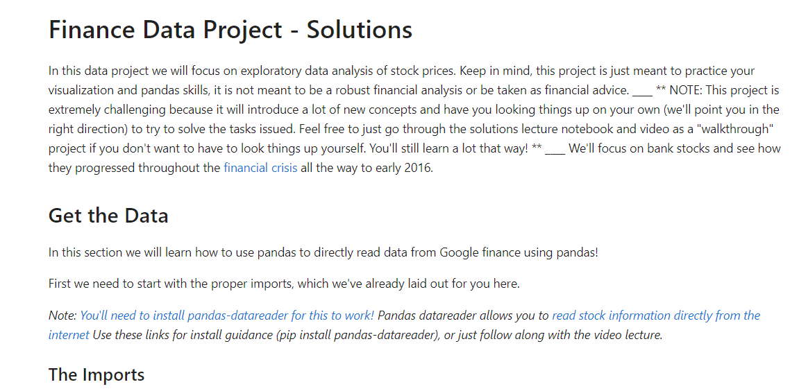

<br/>
<p align="center">
  <h3 align="center">StockPriceAnalysis</h3>

  <p align="center">
    A project for analyzing and extracting insights from stock price data
    <br/>
    <br/>
    <a href="https://github.com/itsskofficial/Data-Science">View Demo</a>
    .
    <a href="https://github.com/itsskofficial/Data-Science/issues">Report Bug</a>
    .
    <a href="https://github.com/itsskofficial/Data-Science/issues">Request Feature</a>
  </p>
</p>

 

## Table Of Contents

* [About the Project](#about-the-project)
* [Built With](#built-with)
* [Getting Started](#getting-started)
  * [Prerequisites](#prerequisites)
  * [Installation](#installation)
* [Usage](#usage)
* [Contributing](#contributing)
* [License](#license)
* [Authors](#authors)
* [Acknowledgements](#acknowledgements)

## About The Project



The Stock Price Analysis Project is a data-driven initiative aimed at extracting valuable insights from historical stock price data. Leveraging advanced analytics, this project seeks to analyze trends, patterns, and crucial information associated with stock prices. By employing data visualization techniques and statistical analysis, the project aims to provide investors and analysts with valuable tools for making informed decisions in the financial markets.

## Built With

This section should list any major frameworks that you built your project using. Leave any add-ons/plugins for the acknowledgements section. Here are a few examples.

* [Python](https://www.python.org/)
* [Pandas](https://pandas.pydata.org/)
* [Matplotlib](https://matplotlib.org/)
* [Numpy](https://numpy.org/)

## Getting Started

This is an example of how you may give instructions on setting up your project locally.
To get a local copy up and running follow these simple example steps.

### Prerequisites

* **pip:**
  
  Ensure you have Python installed, as pip comes bundled with Python distributions.

  ```sh
  # To upgrade pip to the latest version, run:
  python -m pip install --upgrade pip


### Installation

1. **Clone the repo**

    ```sh
    git clone https://github.com/itsskofficial/Data-Science.git
    ```

2. **Enter into the directory**
    ```sh
    cd Projects/StockPriceAnalysis
    ```

3. **Install pip packages**

    ```sh
    pip install -r requirements.txt
    ```

## Usage

The Stock Price Analysis project is a crucial tool with diverse applications, primarily focused on providing valuable insights into historical stock price data. By delving into trends and patterns, this analysis tool offers investors and analysts valuable tools for making informed decisions in the financial markets. Utilizing data visualization techniques and statistical analysis, the project aims to enhance financial decision-making processes and contribute to overall market understanding.

## Contributing

Contributions are what make the open source community such an amazing place to learn, inspire, and create. Any contributions you make are greatly appreciated.

If you have a suggestion that would make this better, please fork the repo and create a pull request. You can also simply open an issue with the tag "enhancement". Don't forget to give the repository a star! Thanks again!

### Creating A Pull Request

1. Fork the Project
2. Create your Feature Branch (`git checkout -b feature/AmazingFeature`)
3. Commit your Changes (`git commit -m 'Add some AmazingFeature'`)
4. Push to the Branch (`git push origin feature/AmazingFeature`)
5. Open a Pull Request

## License

Distributed under the MIT License. See [LICENSE](https://github.com/itsskofficial/Data-Science/blob/main/LICENSE.md) for more information.

## Acknowledgements

* [Jose Portilla](https://www.udemy.com/user/joseportilla/)
* [Shaan Coding](https://readme.shaankhan.dev/)
