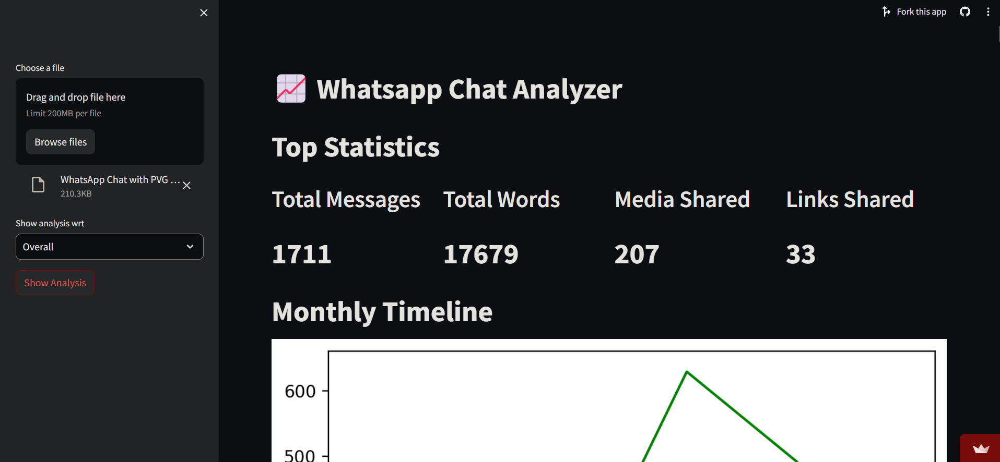

<br/>
<p align="center">
  <h3 align="center">WhatsappChatAnalysis</h3>

  <p align="center">
    A project for analyzing and extracting insights from WhatsApp chat data
    <br/>
    <br/>
    <a href="https://itsskofficial-whatsappchatanalyzer.streamlit.app">View Demo</a>
    .
    <a href="https://github.com/itsskofficial/Data-Science/issues">Report Bug</a>
    .
    <a href="https://github.com/itsskofficial/Data-Science/issues">Request Feature</a>
  </p>
</p>

 

## Table Of Contents

* [About the Project](#about-the-project)
* [Built With](#built-with)
* [Getting Started](#getting-started)
  * [Prerequisites](#prerequisites)
  * [Installation](#installation)
* [Usage](#usage)
* [Contributing](#contributing)
* [License](#license)
* [Authors](#authors)
* [Acknowledgements](#acknowledgements)

## About The Project



The Whatsapp Chat Analysis Project is a data-driven initiative aimed at extracting valuable insights from WhatsApp chat data. Leveraging advanced analytics, this project seeks to analyze trends, patterns, and crucial information associated with chat conversations. By employing natural language processing techniques and statistical analysis, the project aims to provide users with valuable tools for understanding communication patterns, sentiment analysis, and other insights derived from their WhatsApp chats.

## Built With

This section should list any major frameworks that you built your project using. Leave any add-ons/plugins for the acknowledgements section. Here are a few examples.

* [Python](https://www.python.org/)
* [Pandas](https://pandas.pydata.org/)
* [NLTK](https://www.nltk.org/)
* [Streamlit](https://streamlit.io/)

## Getting Started

This is an example of how you may give instructions on setting up your project locally.
To get a local copy up and running follow these simple example steps.

### Prerequisites

* **pip:**
  
  Ensure you have Python installed, as pip comes bundled with Python distributions.

  ```sh
  # To upgrade pip to the latest version, run:
  python -m pip install --upgrade pip


### Installation

1. **Clone the repo**

    ```sh
    git clone https://github.com/itsskofficial/Data-Science.git
    ```

2. **Enter into the directory**
    ```sh
    cd Projects/WhatsappChatAnalysis
    ```

3. **Install pip packages**

    ```sh
    pip install -r requirements.txt
    ```

## Usage

The Whatsapp Chat Analysis project is a crucial tool with diverse applications, primarily focused on providing valuable insights into WhatsApp chat data. By delving into trends and patterns, this analysis tool offers users valuable tools for understanding communication dynamics, sentiment analysis, and other insights derived from their WhatsApp conversations. Utilizing natural language processing techniques and statistical analysis, the project aims to enhance users' understanding of their communication patterns.

## Contributing

Contributions are what make the open source community such an amazing place to learn, inspire, and create. Any contributions you make are greatly appreciated.

If you have a suggestion that would make this better, please fork the repo and create a pull request. You can also simply open an issue with the tag "enhancement". Don't forget to give the repository a star! Thanks again!

### Creating A Pull Request

1. Fork the Project
2. Create your Feature Branch (`git checkout -b feature/AmazingFeature`)
3. Commit your Changes (`git commit -m 'Add some AmazingFeature'`)
4. Push to the Branch (`git push origin feature/AmazingFeature`)
5. Open a Pull Request

## License

Distributed under the MIT License. See [LICENSE](https://github.com/itsskofficial/Data-Science/blob/main/LICENSE.md) for more information.

## Acknowledgements

* [CampusX](https://learnwith.campusx.in/)
* [Shaan Coding](https://readme.shaankhan.dev/)
